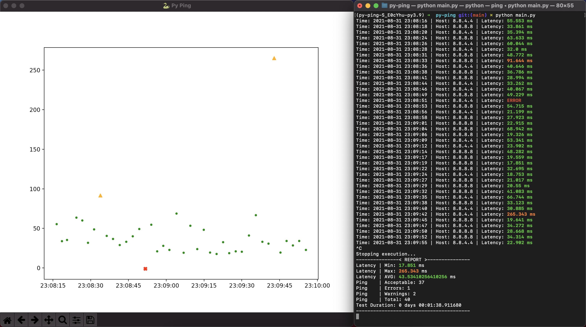

# Py Ping


## Quick Start
```bash
# Install project dependencies
poetry install

# Check where are your venv
poetry env info

# Activate virtual environment
source $path_to_python_venv

# Let's go \o/
python main.py
```

## Screenshots

